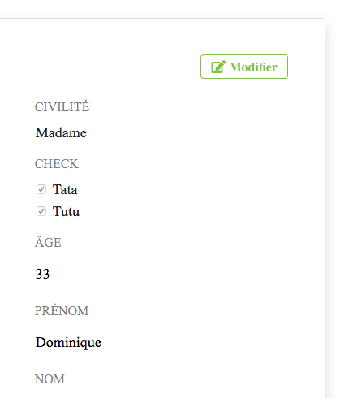
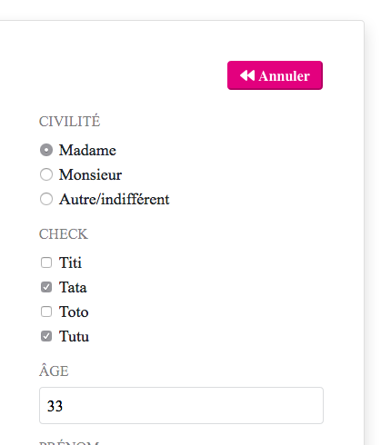

# toggleFormEdition(*btnElement*)

Cleans a \<form>'s appearence when "locking" it. Unchecked items disappear and borders are made transparent so that the form feels like static content.

## Temporary English Documentation


**NOTE** : it currently relies on your project using bootstrap :(


toggleFormEdition is a simple helper function in a French-centric project. Translating this doc is on my to-do list. In the meantime, in case you would want to use it, here is a minimal documentation :

### Setup

1. Link toggleFormEdition to you html by adding this to the \<head> : 

        <script src="js/toggleFormEdition.js" defer></script>
        
2. Use the following html snippet to kickstart your form. (The script relies on ```data-editable="false"``` being set on the form).

        <form id="account_form" data-editable="false">
          <div>
              <button
                class="edit_btn"
                type="button"
                aria-label="Edit this form"
                onclick="toggleFormEdition(this)"
              >
                Edit
              </button>
              <button
                class="revert_btn"
                type="button"
                aria-label="Cancel form edition"
                onclick="toggleFormEdition(this)"
              >
                Cancel
              </button>
                </div>
              <div>
                  <label for="field"> Field </label>
                  <input
                    id="field"
                    name="field"
                    type="TEXT"
                    aria-label="A field to fill"
                    style=" border-color: transparent;
                      padding-left: 0px;
                      color: black;"
                  />
                </div>
                
            <span for="choice"> Choice </span>
        	    <div>
        		    <input
                	    type="radio"
                  	    id="choice_A"
                  	    name="choice_A"
                  	    aria-label="First choice"
                  	    value="choice_A"
                    />
        		    <label for="choice_A"> A </label>
        	    </div>
        	
        	    <div>
        	    	<input
                    	type="radio"
                      	id="choice_B"
                      	name="choice_B"
                      	aria-label="Second choice"
                  	    value="choice_B"
                    />
        		    <label for="choix_B"> B </label>
        	    </div>
        	    <div>
              		<input
                		type="checkbox"
               			name="check_1"
               			aria-label="First option"
                		id="check_1"
                		value="1"
              		/>
              		<label for="check_1">Option</label>
            	</div>
        	    <button type="submit" aria-label="Submit Form">
            	  Submit
            	</button>
           </form>

<br><hr>
           
Permet de verrouiller et déverrouiller un formulaire. 

On peut l'utiliser pour en afficher le contenu existant en lecture seule en "gommant" l'aspect formulaire.

verouillé         |  déverouillé
:----------------:|:-----------------:
|

## Utilisation

### ARGUMENT :  
#### *btnElement* 
- de type : *HTML object*
- doit se trouver au sein du formulaire à rendre éditable/non-éditable.

**Fonctionne avec les pages contenant plusieurs formulaires:** la fonction cible le **\<form>** qui contient l'élément passé en argument.
Ainsi les champs activés sont uniquement ceux du formulaire.

### MISE EN PLACE POUR LE PROJET

Ces opérations ne sont à réaliser qu'une seule fois pour tout le projet.


1. Appeler toggleFormEdition.js dans l'en-tête du html.```<script src="js/toggleFormEdition.js" defer></script>```. 

1. La fonction doit être invoquée par les boutons souhaités du formulaire avec ```onclick="toggleFormEdition(this)"```

### MISE EN PLACE RAPIDE (copier-coller)

        
      <form
          class="d-flex flex-column"
          id="account_form"
          data-editable="false"
          action="route.php?page=****"
          method="post"
          >
          <div class="row">
              <button
                class="edit_btn btn button_outline_green fa fa-edit ml-auto mt-4 mb-4 mr-5 mr-md-3"
                type="button"
                aria-label="éditer les informations du compte"
                onclick="toggleFormEdition(this)"
              >
                Modifier
              </button>
              <button
                class="revert_btn btn button_purple fa fa-backward ml-auto mt-4 mb-4 mr-5 mr-md-3 d-none text-white"
                type="button"
                aria-label="annuler l'édition des informations du compte"
                onclick="toggleFormEdition(this)"
              >
                Annuler
              </button>
                </div>
              <div class="d-flex flex-column mb-3 ml-3 mr-3 ml-md-0 mr-md-0">
                  <label class="h6 mb-0 text-black-50" for="nom"> Nom </label>
                  <input
                    class="afpanize"
                    id="nom"
                    name="nom"
                    type="TEXT"
                    aria-label="Nom"
                    style="
                      border-color: transparent;
                      padding-left: 0px;
                      color: black;
                    "
                  />
                </div>
                
            <span class="h6 text-black-50" for="choix"> Choix </span>
        	    <div class="row align-items-baseline">
        		    <input
                	    type="radio"
                  	    class="mr-2 afpanize"
                  	    id="choix_A"
                  	    name="choix_A"
                  	    aria-label="Premier choix"
                  	    value="choix_A"
                    />
        		    <label class="mb-0" for="choix_A"> A </label>
        	    </div>
        	
        	    <div class="row align-items-baseline">
        	    	<input
                    	type="radio"
                      	class="mr-2 afpanize"
                      	id="choix_B"
                      	name="choix_B"
                      	aria-label="Second choix"
                  	    value="choix_B"
                    />
        		    <label class="mb-0" for="choix_B"> B </label>
        	    </div>
        	    <div class="row flex-row mb-3 ml-3 mr-3 ml-md-0 mr-md-0">
              		<input
              			class="afpanize switch mr-3"
                		type="checkbox"
               			name="check_1"
                		id="check_1"
                		value="1"
              		/>
              		<label for="check_1">Option</label>
            	</div>
        	    <button
              		class="btn button_green text-white align-self-stretch ml-md-auto mr-md-auto mt-3 mb-5 d-none"
              		type="submit"
              		aria-label="Enregistrer les modifications"
            	>
            	  Enregistrer les modifications
            	</button>
           </form>


### MISE EN PLACE DÉTAILLÉE:

1. Dans le HTML ajouter l'attribut ```data-editable="true"``` dans la balise d'ouverture du \<form>

2. Chaque \<input> doit être groupé avec le \<label> qui lui correspond dans une \<div>. La div doit avoir les classes ```d-flex flex-column``` si elle contient des type TEXT, NUMBER, EMAIL, TEL, etc... et les classes ```d-flex flex-row align-items-baseline``` si elle contient des type RADIO ou CHECKBOX.
    
1. Ajouter **"readonly"** dans les balises d'ouverture des inputs. (readonly n'est pas une classe, c'est une propriété en soi qui déclare que l'input est consultable mais n'est pas éditable)

        <input class="..." readonly />

2. Créer deux boutons au sein du formulaire (ils ne sont pas obligatoirement des descendants directs du formulaire) :


        // Bouton d'édition
        
        <button
            class="edit_btn btn [...]"
            type="button"
            aria-label="éditer le formulaire"
            onclick="toggleFormEdition(this)"
        >
            Modifier
        </button>
        
        
        // Bouton de verouillage
        
        <button
            class="edit_btn btn [...]"
            type="button"
            aria-label="annuler l'édition du formulaire"
            onclick="toggleFormEdition(this)"
        >
            Annuler
        </button>
3. Créer deux boutons appelant la fonction **toggleFormEdition()** avec *onclick* et passer l'argument "**this**" à chaque fois (**this** étant le bouton qui fait l'appel de fonction, ce qui permet à la fonction de trouver le formulaire auquel appartient ce bouton).

        <button onclick="toggleFormEdition(this)">
4. Pour verrouiller le formulaire au chargement de la page, plutôt que de mettre le *data-editable* à *true* dans le HTML, (ce qui ne permettrait pas à la fonction de s'executer et d'appliquer ses modifications) il faut appeller la fonction dans une balise script (ou l'appeller dans le fichier .js de la fonctionnalité) en lui passant un sélecteur (l'ID dans l'exemple suivant).

        <script>
        	toggleFormEdition(document.getElementById("mon_formulaire"))
        </script>

### Détails de fonctionnement
L'appel de la fonction permet d'alterner entre un formulaire actif et éditable et un formulaire vérouillé en :

- activant/désactivant le paramètre "*readonly*" des champs d'input
- affichant/masquant les input de type *radio* et *checkbox* du formulaire qui n'ont pas la propriété "*checked*"
- modifiant la couleur des bordures des champs d'input (transparent/opaque)
- modifiant le padding des labels (classe "p-0") pour les rapprocher des inputs quand le formulaire est verrouillé
- affichant/masquant le bouton de type submit du formulaire
- affichant/masquant un bouton d'annulation des modifications